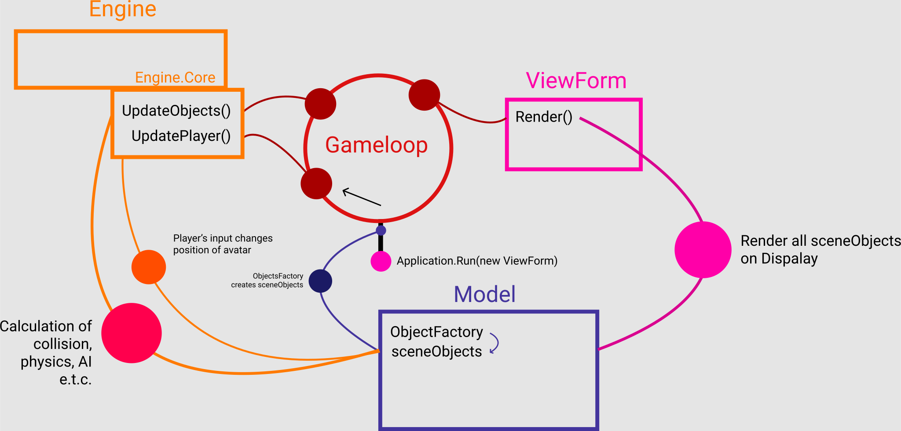

# Game with no Name
 Small game that greatly inspired by Hotline Miami  
 
Participants:
- 7Bpencil
- Vl4d1sl0veZ4r1p0v

------------

------------

### Architecture info

##### Очень коротко:
* Весь движ происходит в **Core.Gameloop** Остальные подсистемы, лишь вызываются им.

---

##### Коротко:

При запуске приложения создается:
1. форма - **ViewForm**
2. ядро движка - **Engine.Core**
3. фабрика объектов - **Model.ObjectFactory**
	
* **Engine.Core** выгружает себе из **Model.ObjectFactory** такие объекты, как *player*, *cursor* и *sceneObjects*. 
* Внутри **ViewForm** начинает тикать таймер каждые **15 мс** (около 66 fps).
* На тики таймера подписывается метод **Core.GameLoop** (то есть этот метод вызывается на каждом тике), каждый раз обновляющий состояние всех объектов.

---

#### Более подробно:

##### Работа Model.ObjectFactory:
> -По запросу Core создает все объекты сцены (включая игрока) и возвращает ссылки на них. (на данный момент все объекты являются *RigidShape*, о нем потом)

##### Работа View.ViewForm:
> **Конструктор** 
-настраивает форму, создает Core и получает ссылки на все объекты сцены - sceneObjects. Запускает таймер и подписывает на него GameLoop

> **Обработчики**
>-Когда игрок жмет на клавиши перемещения, ViewForm перехватывает эти события (override методы OnKeyDown, OnKeyUp) и передает Engine.Core код нажатой клавиши.
> -Когда игрок двигает мышкой, ViewForm перехватывает это событие (override метод OnMouseMove) и передает Engine.Core новую позицию мышки.
>-Далее Engine.Core сохраняет клавишу и новую позицию мыши.

> **-Render-** перерисовывает всю сцену:
> -при получении сигнала от Core.Gameloop дергает Invalidate, что вызывает OnPaint, который уже пробегает *foreach* по списку sceneObjects и вызывает метод Draw у каждого объекта.

##### Работа Engine.Core.Gameloop:
>**-UpdateObjects**- обновляет состояние всех объектов (просчитывает столкновения (коллизию), применяет к объектам силы (физические) => просчитывает их движение, обновляет спрайты и т.д.)
>Пробегает foreach'ем по списку sceneObjects и вызывает метод Update у каждого объекта.
>На данный момент работает "в холостую" (Update пустой), т.к. просчет столкновений и всякой физики отсутствует.

>**-UpdatePlayer-** обновляет состояние игрока (на данный момент это только перемещение)
>-В зависимости от последней нажатой клавиши изменяет координату игрока и курсора.

>**-view.Render-** заставляет ViewForm перерисовать сцену.

Все взаимодействия между тремя элементами MVC проходят через абстрактные классы. (Пришлось ими заменить интерфейсы, так как абстрактные классы гибче)

------------

##### RigidShape - абстрактный класс твердого тела.
потомки: RigidRectangle и RigidCircle (лучше смотреть код)
