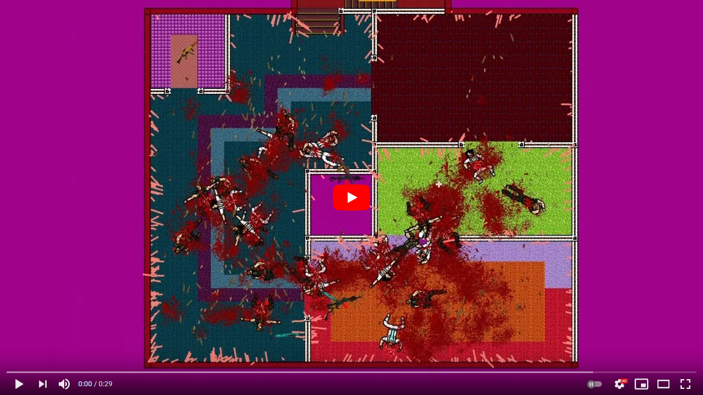

## Hotline Miami Clone
Small game, that greatly inspired by Hotline Miami. 

It was my first attempt to write a program that bigger than 200 LOC.  
The game is written from scratch (except FMOD audio engine) on .NET Framework.  
I was inexperienced and naive, so code is mostly dumb.  
Yet, some ideas are interesting - amount of blood, ammo cases, and bodies is basically unlimited.  
I am thankful that this project happened - it showed me what is what in game dev.

Click on picture to watch gameplay (made by Vl4d1sl0veZ4r1p0v):

### Gameplay
Typical top-down shooter:
* Bots spawn in waves; next wave spawns when previous is completely killed.
* There are multiple types of bots with a different looks, weapons, and health/armor values.
* At the start, you have only a shotgun, other weapons can be picked up.
* Player's ammo is limited to one mag, so pick up another one from dead bodies.
* Melee attack (katana) kills instantly.
* Dash to avoid bullets
* After a few survived waves you can move to the next layer (but the second level is unfinished).

Guns are defined by mag capacity, rate of fire, recoil, bullet weight

* Shotgun - pump-action shotgun, 8 rounds, high recoil, slow rate of fire, fires a light buckshot
* SaigaFA - full-auto shotgun, 20 rounds, medium recoil, medium rate of fire, fires a light buckshot
* MP6 - full auto SMG, 40 rounds, low recoil, high rate of fire, fires medium weight bullet
* AK303 - full-auto rifle, 30 rounds, high recoil, medium rate of fire, fires heavy bullet - can penetrate walls

### Controls
~~~
WASD - move character  
LMB - fire gun  
RMB - melee attack  
Mouse Scroll - change gun  
Left Shift - dash  
Press I to show debug info  
Press P to enable shadows (info below)  
~~~

### Shadows
We tried to add some shadows, but GDI+ cannot handle it, framerate drops significantly.

### Build
    use "dotnet cake" command to build

### License
Sounds are from random youtube videos.  
Some sprites I drew myself, some are from [Hotline Miami](https://store.steampowered.com/app/219150/Hotline_Miami/), some (like blood) are from [Brutal Doom](https://www.moddb.com/mods/brutal-doom).  
So I will leave it unlicensed.

### Participants:
- Vl4d1sl0veZ4r1p0v (taught me GDI+, wrote bot AI)
- 7Bpencil (everything else)
